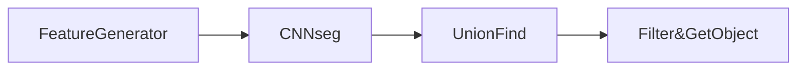

# 从代码看Lidar CNNseg流程

## 1.算法流程

## 2.回到cnn_segmentation.h
### 2.1 定义CNNSegmentation类
```
dir: /apollo/module/perception/obstacle/lidar/segmentation/cnnseg/
```

```
class CNNSegmentation : public BaseSegmentation{}//定义继承于BaseSegmentation的类
Init{}  初始化
Segment{}  分割
```
### 2.2 CNNSegmentation.cc
```
Init{}:
1.设置caffe 运行模式（CPU or GPU）
2.加载预训练的模型
caffe_net_.reset(new caffe::Net<float>(config_.proto_file(), caffe::TEST));
caffe_net_->CopyTrainedLayersFrom(config_.weight_file());
模型存储路径：
/apollo/module/perception/model/cnnseg
3.加载参数配置文件cnnseg.proto
设置并输出至日志文件
路径：
../proto/cnnseg.proto
4. cluster2d初始化,实例化一个cluster2d类
路径：
cluster2d.h
5.FeatureGenerator初始化，实例化一个feature_generator对象
路径：
feature_generator.h
feautre_generator.cc
6.segmet分割开始
bool CNNSegmentation::Segment
6.1 从cnnseg.proto获取参数use_full_cloud
如果True 使用未经高精度地图过滤的点云数据
如果False 使用过滤过的数据
6.2 caffe利用预加载的模型，进行前像传播
caffe_net_->Forward();
6.3 获取cluster方法所需的参数，对cluster2d类进行cluster处理
parm:
use_all_grids_for_clustering 是否利用全部网格点进行cluster
objectness_thresh 对象阈值
6.3 Filter
过滤一些非障碍物
利用caffe cnnseg输出的confidence_pt height_pt
分别为置信度与单元格高度预测
6.4 Classify
障碍物分类预测
6.5 GetObjects
cluster2d_->GetObjects
先根据参数过滤掉一些非障碍物
参数：
confidence_thresh 置信度阈值
height_pt 高度预测阈值，默认为[-5 5]m米
min_pts_num 每个单元格至少所包含的点云个数，默认为3
```
# 3.各个模块方法

请单击链接跳转   

``特征生成``      [FeatureGenerator]()   
``聚类``         [Cluster2d.cluster]()   
``过滤``         [Filter]()     
``分类``         [Classify]()   
``获取障碍物属性`` [GetObject]()  


