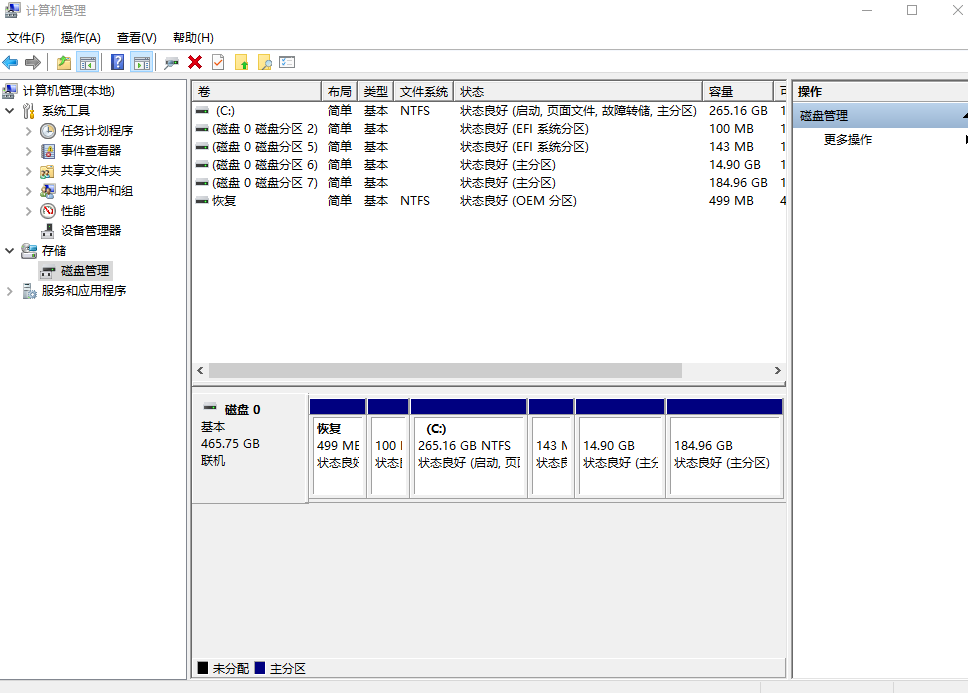
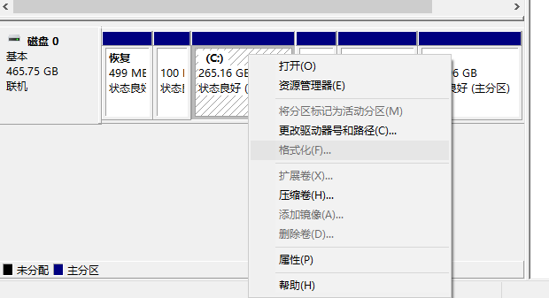
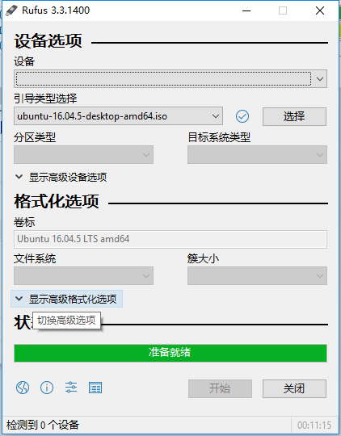

# 在你的电脑上安装Ubuntu 16.04 
建议使用UEFI安装，磁盘格式改为GPT，可以选择MBR。如果之前你电脑存在以前安装的windows，不方便更改格式，那就照旧。
### 1.对于双系统，请先安装Windows，方便分区  
* 分区，分区可以借助分区工具或者Windows里面的磁盘管理工具，下面安装磁盘管理方法。
->右键桌面图标``此电脑``选择``管理``进入，如下图所示

<center>图1 管理</center>
->选中上图中你有空间的磁盘，右键选择``压缩卷``空出合适磁盘大小空间，建议200G，留空不要格式化不要分盘符


<center>图2 压缩磁盘</center>

### 2.准备安装磁盘
* 准备磁盘刻录工具,建议使用``rufus``  

 
 <center> 图3 刻录工具</center>

如果是UEFI启动，在分区类型GPT，如果是其他则选择其他，注意准备安装的启动盘会被格式化，请注意数据备份。单击``开始``就可以将系统镜像刻录到U盘了。

### 3.BIOS设置
* dell E5480 按F2进入BIOS管理，如果要安装nvidia驱动，请将安全启动关闭，然后设置UEFI启动

### 4.安装
对于DELL E5480开机按热键``F12``进入快速启动选择选项，选择你对应你的U盘进行安装
* 进入U盘之后，选择install Ubuntu
* 语言选择简体中文
* 建议断开网络，如果网络过慢可能会安装很慢，对于系统更新可以进入系统后进行
* 分区
  （1）我一般会选择分3个区，EFI启动分区、交换分区、根目录   
  （2）在界面上选中空的磁盘，在第1步中所划分的预留分区，点击``+``号，分区类型选择EFI系统分区，建议200M。对于MBR您应该选择的是挂载/boot   
  （3）同（2）中新建分区选择分区类型为交换空间，建议分区大小为您电脑内存的2倍（网上如是说）  
  （4）将剩下的空间留下给根目录，挂载为``/``,下一步进行后续安装即可
### 5.后续
* 源建议选择国内的源，可以根据您的网络类型，选择合适的源
```
sudo apt-get update
sudo apt-get dist-upgrade
```
* windows时间与Ubuntu时间不同步问题
对于Ubuntu 16.04,原理请自行网络搜索，使用以下命令
> timedatectl set-local-rtc 1 –adjust-system-clock

   对于Ubuntu 14.04 
> sudo vim /etc/default/rcS
 
找到UTC=yes这一行，改成UTC=no
